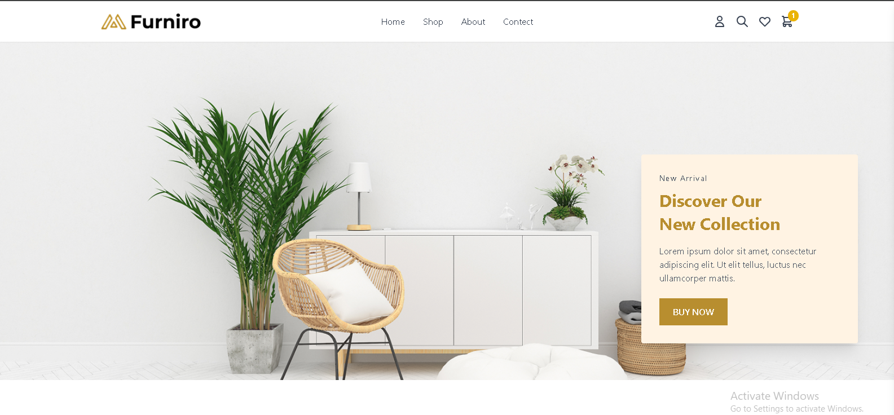

# 🛒 Modern Ecommerce Website

A sleek and responsive ecommerce web app built with React and Tailwind CSS. Includes product listing, shopping cart with localStorage, and smooth user interactions.

### 🔗 Live Demo
👉 [View Live Site](https://askweb10.netlify.app/)

---

## 🚀 Features

- Dynamic product catalog
- Shopping cart with add/remove/update quantity
- Cart data synced with localStorage
- Subtotal & item counter in navbar
- Smooth hover effects & transitions
- Fully responsive layout

---

## 🧰 Tech Stack

- React
- Vite
- Tailwind CSS (CDN)
- Netlify (Deployment)

---

## 📸 Screenshots



---

## 📦 Getting Started

1. Clone the repo:
```bash
git clone https://github.com/your-username/ecommerce-website.git
```

